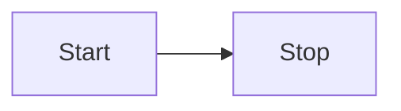
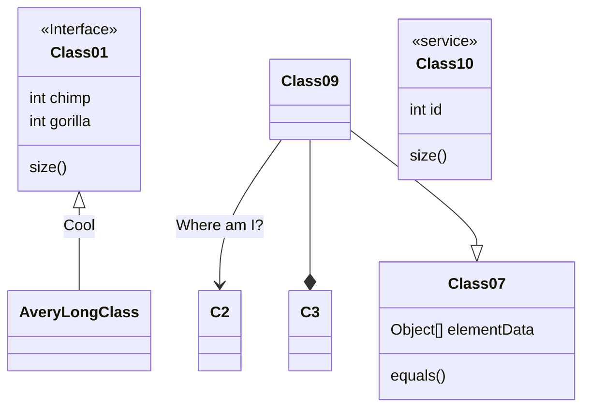

# Getting Started with Next.js

Next.js has become one of the most popular React frameworks for building modern web applications. In this comprehensive guide, we'll walk through everything you need to know to get started with Next.js, from initial setup to deployment.

## What is Next.js?

Next.js is a React framework that provides a complete solution for building production-ready web applications. It offers features like server-side rendering (SSR), static site generation (SSG), API routes, and automatic code splitting out of the box.

## Installation and Setup

To create a new Next.js project, you can use the `create-next-app` command:

```bash
npx create-next-app@latest my-next-app
cd my-next-app
npm run dev
```





This will create a new Next.js project with all the necessary dependencies and start the development server on `http://localhost:3000`.

## Project Structure

A typical Next.js project has the following structure:

- `pages/` - Contains your application routes
- `public/` - Static assets like images and fonts
- `styles/` - CSS files for styling
- `components/` - Reusable React components
- `api/` - API routes for backend functionality

```bunny
dcbcab75-569c-4f6c-b6c7-ed514bd2b839
```

## File-Based Routing

One of Next.js's most powerful features is its file-based routing system. Simply create a file in the `pages` directory, and it automatically becomes a route:

```javascript
// pages/about.js
export default function About() {
  return (
    <div>
      <h1>About Us</h1>
      <p>Welcome to our about page!</p>
    </div>
  );
}
```

## Dynamic Routes

You can create dynamic routes using square brackets in the filename:

```javascript
// pages/blog/[slug].js
import { useRouter } from "next/router";

export default function BlogPost() {
  const router = useRouter();
  const { slug } = router.queries; // [\!code --]
  const { slug } = router.query; // [\!code ++]

  return <h1>Blog post: {slug}</h1>; // [\!code highlight]
}
```

## API Routes

Next.js allows you to create API endpoints within your application:

```javascript
// pages/api/hello.js
export default function handler(req, res) {
  res.status(200).json({ message: "Hello from Next.js API!" }); // [\!code focus]
}
```

## Deployment

Next.js applications can be deployed to various platforms. The easiest way is using Vercel (created by the Next.js team):

1. Push your code to GitHub
2. Connect your repository to Vercel
3. Deploy with zero configuration

## Conclusion

Next.js provides a robust foundation for building modern React applications with excellent performance and developer experience. With features like automatic code splitting, server-side rendering, and easy deployment, it's an excellent choice for both beginners and experienced developers.

Start building your first Next.js application today and experience the power of this amazing framework!
